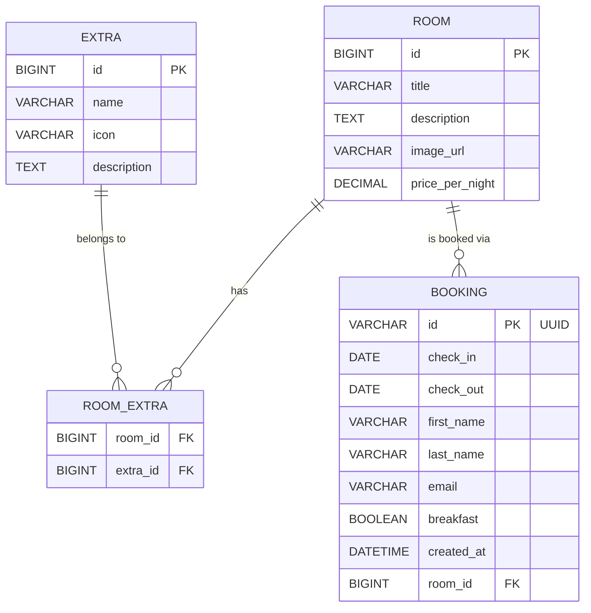

```mermaid
erDiagram
    ROOM {
        BIGINT id PK
        VARCHAR title
        TEXT description
        VARCHAR image_url
        DECIMAL price_per_night
    }

    EXTRA {
        BIGINT id PK
        VARCHAR name
        VARCHAR icon
        TEXT description
    }

    ROOM_EXTRA {
        BIGINT room_id FK
        BIGINT extra_id FK
    }

    BOOKING {
        VARCHAR id PK "UUID"
        DATE check_in
        DATE check_out
        VARCHAR first_name
        VARCHAR last_name
        VARCHAR email
        BOOLEAN breakfast
        DATETIME created_at
        BIGINT room_id FK
    }

    ROOM ||--o{ ROOM_EXTRA : "has"
    EXTRA ||--o{ ROOM_EXTRA : "belongs to"
    ROOM ||--o{ BOOKING : "is booked via"
```
